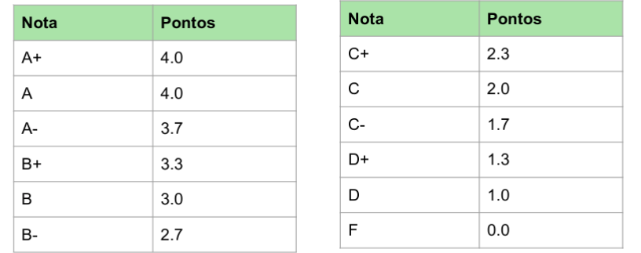
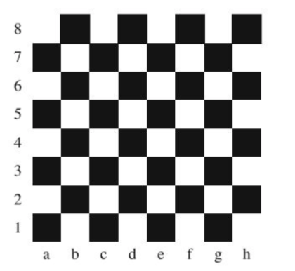
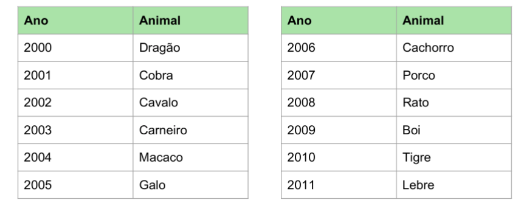
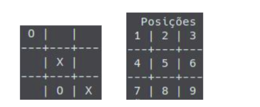
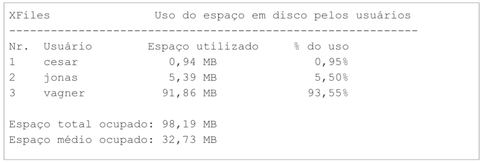
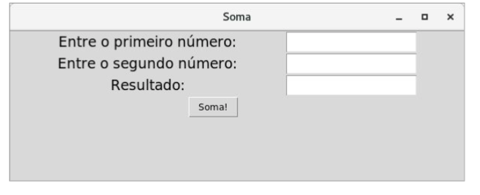

# Enunciados

## Laboratório 01 

**1.** Faça um Programa que mostre a mensagem "Primeiro Programa em Python" na tela.

**2.** Faça um programa que solicita que o usuário entre com seu próprio nome e, depois, imprima o nome do usuário na tela.

**3.** Leia 2 valores inteiros e armazene-os nas variáveis A e B. Efetue a soma de Ae B e imprima o resultado na tela.

**4.** A fórmula  para  calcular  a  área  de  uma  circunferência  é: area  = π  * raio2. Considerando que π = 3.14159, efetue o cálculo da área para o valor de raio obtido do usuário. Exiba o resultado.

**5.** Faça um Programa que peça a temperatura em graus Fahrenheit, transforme e mostre a temperatura em graus Celsius. C = (5 * (F-32) / 9)6.

**6.** Faça um Programa que peça as notas de LAB, P1 e P2 e mostre a média da disciplina. M = (LAB + 2*P1 + 3*P2) / 6

## Laboratório 02

**1.** Faça um programa que lê um valor inteiro entre 1 e 12. Correspondente a este valor, deve ser apresentado como resposta o mês do ano por extenso. 

**2.** Escreva um programa que lê um número inteiro e responde se este número é positivo, negativo ou zero.

**3.** Faça um programa que lê um número inteiro e determina se este número é par ou ímpar (dica: utilize o operador % - resto da divisão).

**4.** Faça um programa que lê um valor x para calcular e imprimir o valor da função y de acordo com as condições:

Se x >= 5: 

Se x < 5: 

**5.** Faça um programa que lê três valores, a, b e c, que correspondem a lados de um triângulo, para calcular, classificar e imprimir os triângulos de acordo com a regra: 

Se a² = b² + c² o triângulo é retângulo. 

Se  a² > b² + c² o triângulo é obtusângulo.

Se  a² < b² + c² o triângulo é acutângulo

Obs: Considerar que a é o maior dos três lados.

**6.** Leia 3 valores inteiros e ordene-os em ordem crescente. No final, mostre os valores em ordem crescente, uma linha em branco e em seguida, os valores na sequência como foram digitados.

## Laboratório 03

**1.** Faça um programa que faça 5 perguntas para uma pessoa sobre um crime. As perguntas são:

● “Telefonou para a vítima?”

● “Esteve no local do crime?”

● ‘Mora perto da vítima?”

● “Devia para a vítima?”

● “Já trabalhou com a vítima?” 

Então,  o  programa  deve  emitir  uma  classificação  sobre  a  participação  da pessoa no crime. Se a pessoa responder positivamente a 2 questões, ela deve ser classificada como "Suspeita", entre 3 e 4 como "Cúmplice" e 5 como "Assassino". Caso contrário, ele será classificado como "Inocente".

**2.** Faça um programa para o cálculo de uma folha de pagamento, sabendo que os  descontos  são  do  Imposto  de  Renda,  que  depende  do  salário  bruto (conforme tabela abaixo) e 10% para INSS e que o FGTS corresponde a 11% do Salário Bruto, mas não é descontado (é a empresa que deposita). O Salário  Líquido  corresponde  ao  Salário  Bruto  menos  os  descontos.  O programa deverá pedir ao usuário o valor da sua hora e a quantidade de horas trabalhadas no mês

Desconto do IR:

○ Salário Bruto até 900 (inclusive) - isento

○ Salário Bruto até 1500 (inclusive) - desconto de 5%

○ Salário Bruto até 2500 (inclusive) - desconto de 10% 

○ Salário Bruto acima de 2500 - desconto de 20% 

Imprima na tela as informações dispostas conforme o exemplo abaixo. No exemplo, o valor da hora é R$ 5,00 e são 220 horas trabalhadas

**3.** Faça um programa que calcule as raízes de uma equação do segundo grau, na forma ax2 + bx + c. O programa deverá pedir os valores de a, b e c e fazer as consistências, informando ao usuário as seguintes situações:

a. Se o usuário informar o valor de a igual a zero, a equação não é do segundo grau e o programa não deve pedir os demais valores, sendo encerrado;

b. Se o delta calculado for negativo, a equação não possui raízes reais. Informe ao usuário e encerre o programa;

c. Se o delta calculado for igual a zero a equação possui apenas uma raiz real; informe-a ao usuário;

d. Se o delta for positivo, a equação possui duas raiz reais; informe-as ao usuário

**4.** Um posto está vendendo combustíveis com a seguinte tabela de descontos:

a. Álcool:

i.até 20 litros, desconto de 3% por litro

ii.acima de 20 litros, desconto de 5% por litro

b.Gasolina:

i.até 20 litros, desconto de 4% por litro

ii.acima de 20 litros, desconto de 6% por litro 

Escreva um programa que solicita o número de litros vendidos e o tipo de combustível (álcool ou gasolina). Então, calcula e imprime o valor a ser pago pelo cliente sabendo-se que o preço do litro da gasolina é R$ 4,20 e, do álcool, R$ 2,80.

**5.** Um zoológico em particular determina o preço da entrada com base na idade do visitante. Os visitantes com 2 anos de idade ou menos têm entrada gratuita. Crianças entre 3 e 12 anos pagam R$ 14,00. Idosos com 65 anos ou mais pagam R$ 18,00. A entrada para todos os outros visitantes custa R$ 23,00. Crie um programa que comece lendo as idades de todos os visitantes de um mesmo grupo, sendo uma idade informada em cada linha. O usuário digitará uma linha em branco para indicar que não há mais pessoas no grupo. Em seguida, seu programa deve exibir o custo total para o grupo. O custo deve ser exibido usando duas casas decimais.

**6.** Faça um programa para um caixa eletrônico. O programa deverá perguntar ao usuário o valor do saque e depois informar quantas notas de cada valor serão fornecidas. As notas disponíveis são as de 1, 5, 10, 50 e 100 reais. O valor mínimo de saque é de 10 reais e o máximo de 600 reais. O programa não deve se preocupar com a quantidade de notas existentes na máquina.

a. Exemplo 1: Para sacar a quantia de 256 reais, o programa fornece duas notas de 100, uma nota de 50, uma nota de 5 e uma nota de 1;

b. Exemplo 2: Para sacar a quantia de 399 reais, o programa fornece três notas de 100, uma nota de 50, quatro notas de 10, uma nota de 5 e quatro notas de 1.

## Laboratório 04

**1.** Neste exercício, você criará um programa que lê uma letra do alfabeto. Se o usuário digitar a, e, i, o ou u, seu programa deverá exibir uma mensagem indicando que a letra inserida é uma vogal. Se o usuário digitar y, seu programa deve exibir uma mensagem indicando que às vezesy é uma vogal (depende da língua, no inglês, por exemplo), e às vezes y é uma consoante. Caso contrário, seu programa deve exibir uma mensagem indicando que o letra é uma consoante.

**2.** Escreva um programa que determine o nome de uma forma pelo seu número de lados. O programa deve ler o número de lados que o usuário digitar e, em seguida, informar o nome apropriado. Seu programa deve suportar formas com 3 até (e incluindo) 10 lados. Se um número de lados fora desse intervalo for  inserido  então  seu  programa  deve  exibir  uma  mensagem  de  erro apropriada.

● 3 lados → triângulo

● 4 lados → quadrilátero

● 5 lados → pentágono

● 6 lados → hexágono

● 7 lados → heptágono

● 8 lados → octágono

● 9 lados → eneágono

● 10 lados → decágono

**3.** O ano é dividido em quatro estações: primavera, verão, outono e inverno. As datas exatas em que as estações mudam podem variar um pouco de ano para ano por causa da maneira que o calendário é construído. Neste exercício, usaremos as seguintes datas limites:

Crie um programa que recebe do usuário um mês e um dia. O usuário entrará o nome do mês como uma string, seguido do dia do mês como um inteiro. Então, seu programa deve exibir a estação associada à data que foi introduzida.

**4.** Em uma universidade particular, as notas das cartas são mapeadas para pontos de notas nas seguintes maneira:

Escreva um programa que comece lendo uma nota do usuário. Então, o seu programa deve computar e exibir o número equivalente de pontos. Certifique-se de que seu programa gere uma mensagem de erro apropriada se o usuário inserir uma nota inválida.

**5.** Posições em um tabuleiro de xadrez são identificadas por uma letra e um número. As letras identificam as colunas, enquanto os números identificam as linhas, conforme mostrado abaixo:

Escreva um programa que leia uma posição inserida por um usuário. Primeiro a coluna, depois a linha. Use uma declaração if para determinar se a coluna começa com um quadrado preto ou um quadrado branco. Em seguida, use modular aritmética (%) para relatar a cor do quadrado nessa linha. Por exemplo, se o usuário entrar a - 1então seu programa deve informar que o quadrado é preto. Se o usuário digitar d - 5 então seu programa deve informar que o quadrado é branco. Seu programa pode assumir que uma posição válida sempre será inserida. 

**6.** O zodíaco chinês atribui animais a anos em um ciclo de 12 anos. Um ciclo de 12 anos é mostrado nas tabelas abaixo. O padrão se repete a partir daí, com 2012 sendo outro ano do Dragão, e 1999 sendo mais um ano da Lebre.

Escreva um programa que leia um ano do usuário e exiba o animal associado com aquele ano. Seu programa deve funcionar corretamente para qualquer ano maior ou igual a zero, não apenas para os listados nas tabelas acima.

**7.** Escreva um programa que leia os valores de dia, mês e ano de uma data, inserida pelo usuário, e calcule a próxima data imediata. Por exemplo, se o usuário inserir valores que representem 18/11/2013, seu programa deve exibir uma mensagem indicando que o dia imediatamente após é 19/11/2013. Se o usuário inserir valores que representem 30/11/2013, o programa deve indicar que o dia seguinte é 01/12/2013. Se o usuário inserir valores que representem 31/12/2013 então o programa deve indicar que o dia seguinte é 01/01/2014. Certifique-se de que o seu programa funciona corretamente para anos bissextos.

**8.** Em uma determinada empresa, os funcionários são classificados no final de cada ano. A escala de classificação começa em 0.0, com valores mais altos indicando melhor desempenho. O valor atribuído a um funcionário é 0.0, 0.4 ou 0.6 ou mais. Valores entre 0.0 e 0.4 e entre 0.4 e 0.6 nunca são usados. O significado associado a cada classificação é mostrado na tabela a seguir. O valor do aumento de um funcionário é $ 2400.00 multiplicado pela sua classificação.

Escreva um programa que leia a classificação do funcionário e indique se o desempenho é inaceitável, aceitável ou excelente. O valor do aumento que o funcionário receberá também deve ser relatado. Seu programa deve exibir um erro apropriado se uma classificação inválida for inserida.

## Laboratório 05

**1.** Escreva um programa que converta um número decimal (base 10) em binário (base 2). Leia o número decimal do usuário como um inteiro e, em seguida, use o pseudocódigo de divisão mostrado abaixo para realizar a conversão. Quando o algoritmo é concluído, o resultado contém a representação binária do número. Exiba o resultado.

**2.** Faça um Programa que leia 20 números inteiros e armazene-os num vetor. Armazene os números pares no vetor par e os números impares no vetor ímpar. Imprima os três vetores.

**3.** Faça um programa que carregue uma lista com os modelos de cinco carros (exemplos: FUSCA, GOL, VECTRA etc). Carregue uma outra lista com o consumo desses carros, isto é, quantos quilômetros cada um desses carros faz com um litro de combustível. Calcule e mostre:

a)O modelo do carro mais econômico;

b)Quantos litros de combustível cada um dos carros cadastrados consome para percorrer uma distância de 1000 quilômetros e quanto isto custará, considerando um que a gasolina custe R$ 4,09 o litro.  

**4.** Crie um programa que leia números inteiros do usuário até que uma linha em branco seja inserida. Uma vez que todos os números inteiros tenham sido lidos, seu programa deve exibir todos os números negativos, seguidos por todos os zeros, seguidos por todos os números positivos. Dentro de cada grupo, os números devem ser exibidos na mesma ordem em que foram inseridos pelo usuário. Por exemplo, se o usuário inserir os valores 3, -4, 1, 0, -1, 0 e -2, seu programa deverá exibir três linhas:

-4, -1, -20, 

0,0 

3, 1

**5.** Para ganhar o prêmio principal em uma determinada loteria, é preciso combinar todos os 6 números em seu bilhete com os 6 números entre 1 e 49 que são sorteados pelo organizador da loteria. Escreva um programa que gere uma seleção aleatória de 6 números para um bilhete de loteria. Assegure-se de que os 6 números selecionados não contenham duplicatas. Exiba os números gerados.

**6.** Escreva um programa que calcule o quociente e o resto da divisão inteira entre dois números. Utilize apenas as operações de soma e subtração para calcular o resultado.

**7.** O crivo de Eratóstenes é uma técnica que foi desenvolvida há mais de 2.000 anos atrás para encontrar facilmente todos os números primos entre 2 e algum limite. Uma descrição do algoritmo é a seguinte:

Este algoritmo está baseado no fato de ser relativamente fácil desconsiderar todos os números n em um pedaço de papel. Essa também é uma tarefa fácil para um computador - um loop for pode simular esse comportamento quando um terceiro parâmetro é fornecido para a função range(). Quando um número é descartado, sabemos que ele não é mais primo, mas ainda ocupa espaço no pedaço de papel, e ainda deve ser considerado ao computar números primos posteriores.

Como resultado, você não deve descartar um número removendo-o da lista. Em vez disso, você deve descartar um número substituindo-o por 0. Em seguida, assim que o algoritmo for concluído, todos os valores diferentes de zero na lista serão primos.Crie um programa em Python que use esse algoritmo para exibir todos os números primos entre 2 e um limite digitado pelo usuário. Se você implementar o algoritmo corretamente, você deve ser capaz de exibir todos os números primos menores que 1.000.000 em apenas alguns segundos.

## Laboratório 06

**1.** Faça uma função que receba três notas de um aluno como parâmetros e uma letra. Se a letra for A, a função deverá calcular a média aritmética das notas do aluno; se for P deverá calcular a média ponderada com pesos 5, 3 e 2. A média calculada deve ser devolvida à função principal para, então, ser mostrada.

**2.** Foi realizada uma pesquisa sobre algumas características físicas de cinco habitantes de uma certa região. Foram coletados os seguintes dados de cada habitante: sexo, cor dos olhos (azuis ou castanhos), cor dos cabelos (Louros, Pretos ou Castanhos) e idade.

● Faça uma função que leia esses dados, armazenando-os em listas.

● Faça uma função que determine e devolva à função principal a média de idade das pessoas com olhos castanhos e cabelos pretos.

● Faça uma função que determine e devolva ao programa principal a maior idade entre os habitantes.

● Faça uma função que determine e devolva ao programa principal a quantidade de indivíduos do sexo feminino com idade entre 18 e 35 anos (inclusive) e que tenham olhos azuis e cabelos louros.

**3.** Escreva uma função em Python para retornar a somatória e a média de todos os números que estão armazenados no arquivo “numeros_6_3.txt”. 

**4.** Escreva uma função que leia uma sequência numérica do arquivo “numeros_6_4.txt” e salva os números na lista num. Esta função deve retornar num. Escreva outra função que recebe a lista num como parâmetro e retorna uma nova lista num_unicos, sem os elementos repetidos. Escreva uma terceira função que recebe a lista num_unicos e grava os números no arquivo “numeros_6_4_unicos.txt”

**5.** Crie uma agenda de telefones que salva os dados de maneira permanente. A agenda deve funcionar em loop infinito, até que o usuário decida sair. Os dados armazenados são: nome, sobrenome, telefone e e-mail. A agenda deve apresentar o seguinte menu para o usuário:

Opções:

1 - Novo contato (Create)

2 - Procura (pelo nome) (Read)        

3 - Atualiza contato (Update)

4 - Apaga contato(Delete)

0 - Sai

## Laboratório 07

**1.** Define-se o elemento MINMAX de uma matriz como sendo o maior elemento da linha onde se encontra o menor elemento da matriz. Faça um programa que carregue uma matriz 5x7 com números reais aleatórios e mostre o elemento MINMAX e sua posição na matriz (linha e coluna).

**2.** Faça um programa que cria uma matriz, A, 10x5 com números inteiros aleatórios e, então, exiba a matriz transposta de A ( At  ).  

Determinar a transposta de uma matriz é reescrevê-la de forma que suas linhas e colunas troquem de posições ordenadamente, isto é, a primeira linha é reescrita como a primeira coluna, a segunda linha é reescrita como a segunda coluna e assim por diante, até que se termine de reescrever todas as linhas na forma de coluna.

**3.** Faça um programa que utilize uma matriz com dimensões 5 linhas x 4 colunas e solicite que sejam digitados números (desordenadamente) e armazene-os ordenadamente na matriz. Exemplo: supondo que sejam digitados os seguintes números: 10, 1, 2, 20, 30, 17, 98, 65, 24, 12, 5, 8, 73, 55, 31, 100, 120, 110, 114, 130, estes deverão ser armazenados na matriz da seguinte maneira:

**4.** Leia um caractere maiúsculo, que indica uma operação que deve ser realizada em uma matriz M[12][12]. Em seguida, calcule e mostre a soma ou a média considerando somente aqueles elementos que estão abaixo da diagonal principal da matriz, conforme ilustrado abaixo (área verde).

A  entrada  do  programa  deve  ser  um  único caractere  maiúsculo  'S'  ou  'M',  indicando  a operação  (Soma  ou  Média)  que  deverá  ser realizada com os elementos da matriz. A matriz M, 12  x  12,  deve  ser  criada  com  números  inteiros aleatórios.O programa deve imprimir o resultado solicitado (a soma ou média), com 1 casa após o ponto decimal.

**5.** Uma escola deseja controlar as médias das disciplinas cursadas por seus alunos. Sabe-se que nessa escola existem três turmas, com oito alunos cada, e cada aluno cursa quatro disciplinas. Crie um programa que armazene essas médias em uma matriz de três dimensões (listas aninhadas): 3 x 8 x 4. Depois da leitura, o seu programa deverá conter as seguintes funções:

● Função para cálculo da média geral de cada aluno;

● Função para cálculo da média de cada turma.

## Laboratório 08

Escreva um jogo da velha para duas pessoas. O jogo deve perguntar onde você quer jogar e alternar entre os jogadores. A cada jogada, o algoritmo deve verificar se a posição está livre. O algoritmo deve também conseguir dizer quando um jogador vence uma partida ou quando a partida termina empatada. Lembre-se que o jogo da velha é uma matriz 3 x 3. A exibição do jogo deve ser semelhante ao exemplo:

## Laboratório 09

A empresa XFiles está tendo problemas de espaço em disco no seu servidor de arquivos. Para tentar resolver este problema, o Administrador de Rede precisa saber qual o espaço ocupado pelos usuários, e identificar os usuários com maior espaço ocupado. Através de um programa, ele conseguiu gerar o arquivo chamado "usuarios.txt". A partir deste arquivo, você deve criar um programa que gere um relatório, chamado "relatorio.txt", no seguinte formato:

A conversão do espaço ocupado em disco, de bytes para megabytes deverá ser feita  através  de  uma  função  separada,  que  será  chamada  pelo  programa principal. O cálculo do percentual de uso também deverá ser feito através de uma função, que será chamada pelo programa principal.

## Laboratório 10

**1.** Peça ao usuário uma string e imprima se essa string é um palíndromo ou não. Palíndromo é uma palavra ou frase (normalmente, ignorando-se os espaços em branco) que se pode ler, indiferentemente, da esquerda para a direita ou vice-versa. Exemplos: “ovo”; “a grama é amarga”

**2.** Neste exercício, você criará um programa em Python que identifica a(s) palavra(s) mais longa(s) em um arquivo. Seu programa deve exibir uma mensagem que inclua o tamanho da palavra mais longa, juntamente com todas as palavras desse comprimento que ocorreram no arquivo. Desconsidere sinais de pontuação. Utilize o arquivo “Python.txt”, que está no Moodle, para testar.

**3.** Escreva um programa que exiba a(s) palavra(s) que ocorre(m) com mais freqüência em um arquivo e quantas vezes a(s) palavra(s) aparece(m). Seu programa deve começar lendo o nome do arquivo do usuário. Em seguida, ele deve encontrar a(s) palavra(s) mais frequente(s), ignorando letras maiúsculas ou minúsculas e a pontuação. Desta forma, por exemplo, as palavras apple, apple!, Apple, APPLE e ApPlE devem todas ser contadas como uma única palavra. Para testar, utilize o texto “Python.txt” que está no Moodle.

**4.** Pig Latin é uma língua construída pela transformação de palavras da língua inglesa. Embora as origens da língua sejam desconhecidas, ela é mencionada em pelo menos dois documentos do século XIX, sugerindo que ela existe há mais de 100 anos. As seguintes regras são usadas para traduzir o inglês para o Pig Latin:

a. Se a palavra começar com uma consoante (incluindo y), todas as letras no início da palavra, até a primeira vogal (excluindo y), serão removidas e adicionadas ao final da palavra, seguidas de ay. Por exemplo, computer se torna um omputercay e thinkse torna inkthay.

b. Se a palavra começar com uma vogal (não incluindo y), então way é adicionado ao final da palavra. Por exemplo, o algorithm se torna algorithmway e office se torna officeway.Escreva um programa que leia uma linha de texto do usuário. Então, seu programa deve traduzir a linha para Pig Latin e exibir o resultado. Trate letras maiúsculas, minúsculas e pontuação.

## Laboratório 11

**1.** Escreva uma função chamada procuraReversa que encontre todas aschaves, em um dicionário, que estão associadas a um valor específico. Afunção receberá o dicionário e o valor a procurar como seus únicosparâmetros. A função retornará uma lista (possivelmente vazia) de chavesassociadas ao valor fornecido. Faça um programa principal que mostra a ofuncionamento da função. Seu programa principal deve criar um dicionário emostrar que a função procuraReversa funciona corretamente quando retornavárias chaves, uma única chave ou nenhuma chave.

**2.** Neste exercício, você simulará 1.000 lançamentos de dois dados. Comeceescrevendo uma função que simula o lançamento de um par de dados deseis lados cada. Sua função não deve aceitar nenhum parâmetro. Elaretornará a somatória obtida pelos dois dados. Escreva um programaprincipal que use sua função para simular 1.000 lançamentos de dois dados.Como acontece em alguns programas, você deve contar o número de vezesque cada somatória acontece. Em seguida, a função principal deve exibiruma tabela que resume esses resultados. Mostre a frequência para cadaresultado como uma porcentagem do número total de lançamentos.

**3.** Crie um programa que exibe o número de caracteres únicos em uma stringcriada pelo usuário. Por exemplo, Hello, World! tem 10 caracteres únicos,enquanto zzz tem somente um caractere único.Use um dicionário pararesolver este problema.

**4.** Duas palavras são anagramas se contiverem todas as mesmas letras, masem uma ordem diferente. Por exemplo, estante e setenta são anagramas.Crie um programa que recebe duas strings do usuário e determina se elassão ou não anagramas. Utilize dicionário para resolver o problema.

**5.** Um cartão de bingo consiste de 5 colunas de 5 números. As colunas sãorotuladas com as letras B, I, N, G e O. Existem 15 números que podemaparecer na coluna de cada letra. Em particular, os números que podemaparecer na coluna de B estão no intervalo de 1 a 15, os números quepodem aparecer sob o I variam de 16 a 30 e assim por diante. Escreva umafunção que cria um cartão de Bingo com números aleatórios e armazena tudoem um dicionário. As chaves serão as letras B, I, N, G e O. Os valores serãoas listas de cinco números que aparecem em cada letra. Escreva umasegunda função que exibe o cartão de Bingo com as colunas identificadasadequadamente. Use estas funções para escrever um programa que exibeum cartão aleatório.

**6.** Embora a popularidade dos cheques como método de pagamento tenha diminuído nos últimos anos, algumas empresas ainda os emitem para pagar funcionários ou fornecedores. A quantia que está sendo paga normalmente aparece duas vezes em um cheque, com uma ocorrência escrita com números e outra ocorrendo com palavras. Repetir o valor em dois formulários diferentes torna muito mais difícil para um funcionário ou fornecedor inescrupuloso modificar o valor do cheque antes de depositá-lo. Neste exercício, sua tarefa é criar uma função que receba um número inteiro entre 0 e 999 como seu único parâmetro e retorne uma string contendo as palavras em português para esse número. Por exemplo, se o parâmetro para a função for 142, sua função deve retornar “cento e quarenta e dois”. Use um ou mais dicionários para implementar sua solução, em vez de grandes construções if / elif / else. Inclua um programa principal que leia um inteiro do usuário e exiba seu valor em palavras.
 
 ## Laboratório 12

Faça a seguinte interface gráfica para somar dois números:

Desafio: Pesquise como atribuir um texto para a caixa de texto referente ao Resultado da operação.

**2.** Crie um programa que lê uma letra do alfabeto por uma caixa de texto. Se o usuário digitar a, e, i, o ou u, seu programa deverá exibir uma mensagem indicando que a letra inserida é uma vogal (utilize caixas de mensagem).  Se o usuário digitar y, seu programa deve exibir uma mensagem indicando que às vezes y é uma vogal (depende da língua, no inglês, por exemplo), e às vezes y é uma consoante. Caso contrário, seu programa deve exibir uma mensagem indicando que o letra é uma consoante

**3.** Construa um relógio digital que atualize a cada 1 segundo e exiba, além da hora, o dia, mês e ano.

**4.** Uma locadora de veículos te contratou para fazer o aplicativo que controla os aluguéis. Assim, faça uma interface gráfica para cadastro de automóveis (o cadastro deve ser armazenado em arquivo texto). A janela principal deve ter entrada para os seguintes dados:

● Marca do veículo, Modelo, Ano de fabricação, Placa, Km

Utilize checkbuttons para os acessórios: Ar condicionado, Direção hidráulica, Rádio, Airbag

Além disso, a janela principal deve ter um menu que permita a abertura de outra janela que deve exibir os dados de um veículo por meio de sua placa, em uma área de texto com barra de rolagem.

**5.** Faça uma calculadora com as 4 operações básicas, potência, sen, cos, tan, log e raiz quadrada.

## Laboratório 13

A técnica de pomodoro envolve concentrar-se em uma tarefa por períodos de 25 minutos e então parar por um intervalo de tempo curto. Assim, vamos construir um cronômetro que fará a contagem regressiva por 25 minutos (para testar, vamos construir um que trabalhe com 25 segundos) e alertará o usuário quando o tempo acabar (caixa de mensagem). O janela principal deve ter um menu que permita a abertura de uma nova janela que exibe um log com todas as tarefas completas. Siga o layout abaixo: